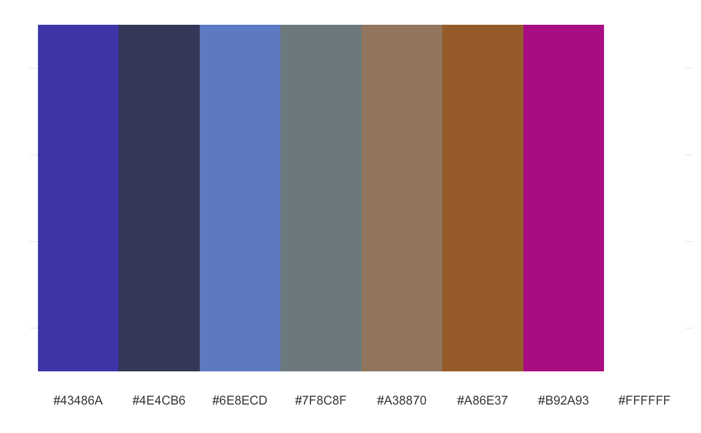
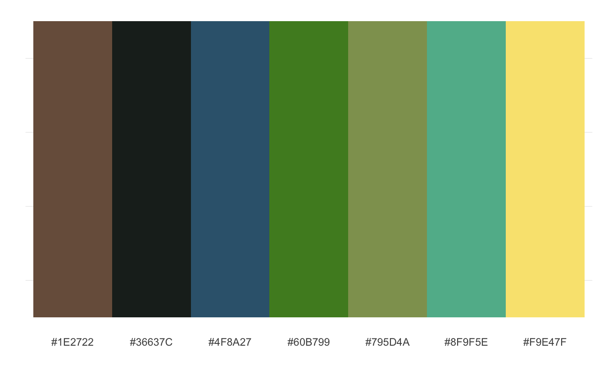
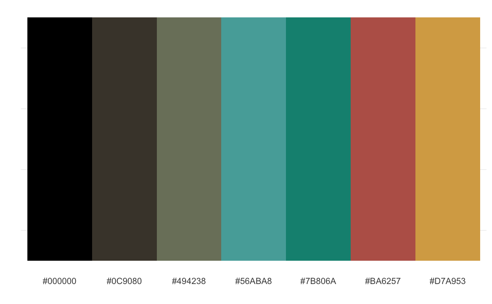
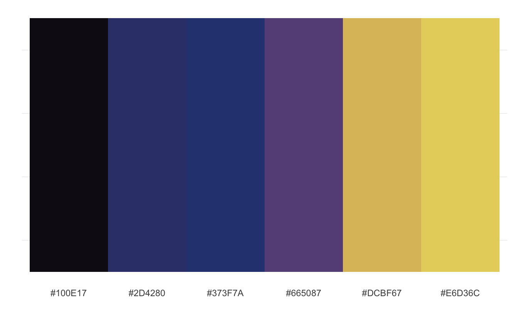
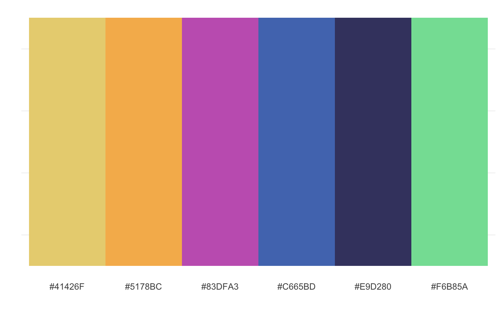
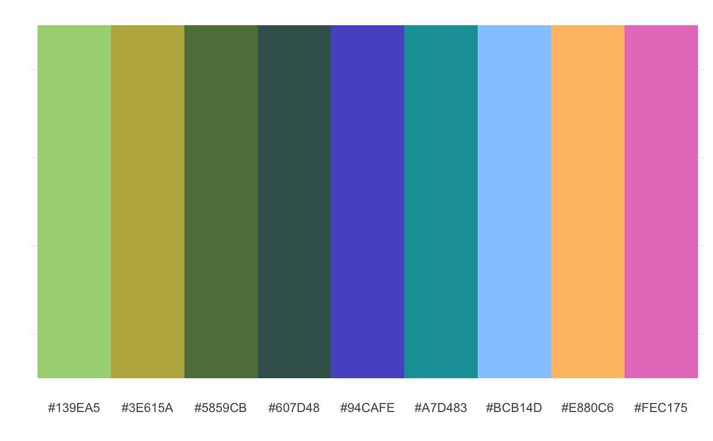

# JJBApalette (under construction)

Color palettes for ggplot2 inspired by JOJO's Bizzare Adventure characters.

### Installation

Downloads of this package is supported via GitHub. 

```r
library(devtools)
install_github("iasnobmatsu/JJBApalette")
```

### Current Palettes

Currently, the package includes palettes for the following characters.

- Jonathan Joestar
- Joseph Joestar
- Kujo Jotaro
- Higashiyama Josuke
- Giorno Giovanna
- Jolyne Cujoh

### Usage 

Using the character Jolyne Cujoh as an example, the corresponding palettes can be viewed using `jolyne_palette(name="anime")` where `name="manga"` can also be used to view the colored manga palette.

The package can be used with ggplot2. For example, for the character Jolyne Cujoh, functions `  scale_fill_jolyne` and `  scale_color_jolyne` are available.

### Colors (Anime) 

##### Jonathan Joestar



##### Joseph Joestar



##### Kujo Jotaro



##### Higashiyama Josuke



##### Giorno Giovanna



##### Jolyne Cujoh




### Acknowledgement

This package is inspired by [Harry Potter palettes](https://github.com/aljrico/harrypotter) and [Rock Themes palattes](https://github.com/johnmackintosh/rockthemes).

Colors used in *JJBApallete* are from [JoJo Wiki](https://jojowiki.com/).

If you haven't watched/read JoJo's Bizzare Adventure, I highly recommend both the anime and the manga.
